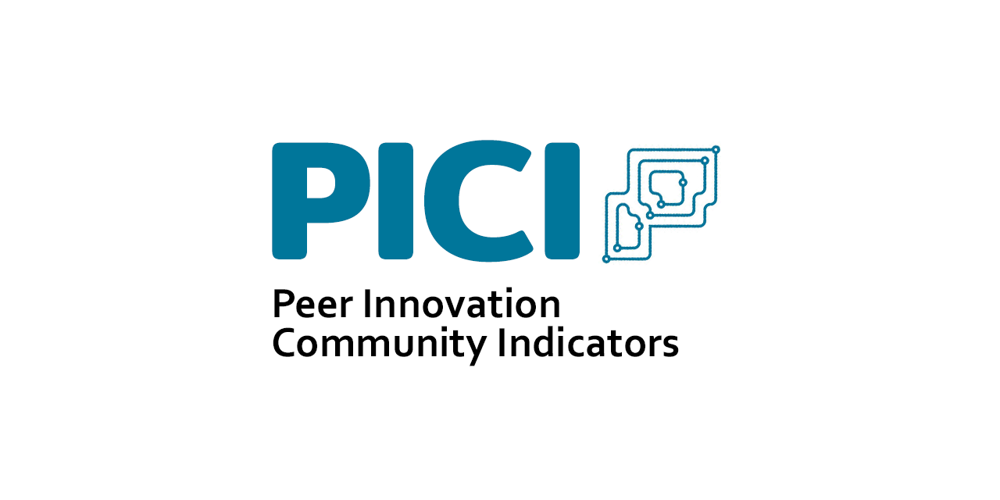

<p align="left"><a href="https://www.peer-innovation.de" target="_blank">
    
</a></p>

PICI (Peer Innovation Community Indicators) is a Python toolbox for exploring indicators of innovation in online communities. It is part of the [Peer Innovation](https://www.peer-innovation.de/) project.

*currently under development*

# Installation

PICI requires Python >= 3.8. To install, clone the git repository, install [cdlib](https://pypi.org/project/cdlib/), then install the package with [poetry](https://python-poetry.org/):

```
git clone https://github.com/phihes/pici.git
cd pici
pip install cdlib mkdocs poetry
poetry install
```

# Documentation

[View documentation](https://phihes.github.io/pici/)
