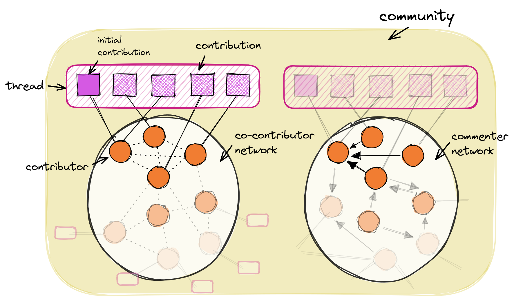

# Indicators

Goal of the indicators: XYZ.

By default, the central unit of observation is the forum **thread**, which can be part of one or multiple sub-forums. We propose that a thread is the *observable trace* of a sequence of interactions that can represent or display innovation activities. Each post in a thread is a **contribution** by a community member (the **contributor**). We single out the **initial contribution**, as we assume that XYZ. A **community** consists of a number of contributors and their contributions in threads, which are organized in sub-forums.

Additional levels of observation are the **networks** formed by contributors. The two main representations are the *co-contribution network* and the *comment network*.

`co-contributor network`

: The co-contributor network is an *undirected graph* where each node represents a contributor. A pair of contributors is connected by an edge if both have contributed in at least one shared thread. The edge weight is proportional to the number of threads both contributed to.

`commenter network`

: The commenter network is a *directed graph* where each node represents a contributor. A contributor *A* has an edge pointing to contributor *B* if *A* has contributed in at least one thread where contributor *B* has posted the initial contribution (*A* has "commented"). The weight of edge *A*→*B* is proportional to the total number of comments *A* made on initial contributions of *B*.

    

Each indicator is observed on either **contributor**, **contribution**, **thread**, or **community** level. Aggregations of indicators are provided for higher levels. For example, the *number of contributions made by a contributor* can be an indicator for their role in the community. This indicator would be provided on thread-level as, e.g., *average number of contributions per contributor*, measured for all contributors that have contributed to a specific thread. Common aggregations are mean, sum, standard-deviation, min and max. Other aggregations (or *transformations*) could also pick out a single of multiple values. On thread-level, an example would be the *total number of contributions made by the contributor of the initial contribution*.

In order to be able to apply indicators to a heterogeneous set of communities, most indicators rely on the following basic data that can be collected from most online forums:

- contribution meta data: contributor, date, associated thread, position in thread, sub-forum
- contribution content: text, html, extracted links, images
- contributor properties: name/id
- thread: title

Other data, such as likes/upvotes, friendship-relations, contributor location, thread views, etc., might be available in some communities and can be included in more specialized indicators.

The following list conceptually groups all available indicators. Each indicator description links to all relevant metrics that are implemented in the toolbox. Each indicator is labelled with its level of observation: contributor contribution initial contribution
 thread community. Specialized indicators are marked with specialized and state which additional data is required.

Please refer to the [user guide]() and the [examples]() on how to [generate the indicators]() or how to [implement a custom indicator]().

## Status and reputation

### In-degree centrality

- [``in-degree centrality``](../reference/pici/metrics/network/#pici.metrics.network.in_degree_centrality)

[1] Füller, J., Hutter, K., Hautz, J., & Matzler, K. (2014). User Roles and Contributions in Innovation-Contest Communities. Journal of Management Information Systems, 31(1), 273–308. https://doi.org/10.2753/MIS0742-1222310111

### Average number of replies to initial contribution

- [``avg number of replies``](../reference/pici/metrics/basic/#pici.metrics.basic.replies_to_initial_post)

[1] Yuan, X., Yang, S., & Wang, C. (2017). Lead user identification in online user innovation communities: A method based on random forest classification. *2017 7th IEEE International Conference on Electronics Information and Emergency Communication (ICEIEC), 157–160.* https://doi.org/10.1109/ICEIEC.2017.8076534

## Expertise

### PageRank

[1] Zhang, J., Ackerman, M. S., & Adamic, L. (2007). Expertise Networks in Online Communities: Structure and Algorithms. *WWW ’07: Proceedings of the 16th International Conference on World Wide Web, 221–230.*

[2] Agichtein, E., Castillo, C., & Donato, D. (2008). Finding High-Quality Content in Social Media. *Proceedings of the 2008 International Conference on Web Search and Data Mining, 11.*

### HITS

## Experience

### Topic re-occurence
initial contribution

"The number of times a topic of the uploaded idea appeared in previous own ideas".

[1] Resch, C., & Kock, A. (2020). The influence of information depth and information breadth on brokers’ idea newness in online maker communities. *Research Policy, 104142.* https://doi.org/10.1016/j.respol.2020.104142

### Previous knowledge domains
initial contribution

"The number of different knowledge domains with which an individual engaged in previous own ideas"

[1] Resch, C., & Kock, A. (2020). The influence of information depth and information breadth on brokers’ idea newness in online maker communities. *Research Policy, 104142.* https://doi.org/10.1016/j.respol.2020.104142

### Tenure

contributor

TODO:would have to include data since forum inception..?!

- [``days since first contribution``](../reference/pici/metrics/basic/#pici.metrics.basic.days_since_first_contribution)

### Absolute contribution

contributor

Number of contributions, number of intial contributions.

- [``number of contributions``](../reference/pici/metrics/basic/#pici.metrics.basic.number_of_contributions)
- [``number of initial contributions``](../reference/pici/metrics/basic/#pici.metrics.basic.number_of_initial_contributions)

### Normalized contribution

contributor

Number of contributions, number of initial contributions; normalized by time spent in community / length of contribution / number of replies to initial contribution

- [``number of contributions``](../reference/pici/metrics/basic/#pici.metrics.basic.number_of_contributions)
- [``number of initial contributions``](../reference/pici/metrics/basic/#pici.metrics.basic.number_of_initial_contributions)

### Out-degree centrality

contributor

## Diversity of contributions

### Sub-forum diversity
contributor

The diversity of a contributor's contributions in regard to which sub-forum they were made to. Diversity is either defined as a) *total number of different sub-forums*, or b) *the entropy of contributing behavior in gerade to sub-forum "classes"*. Each metric is defined for both 1) *all contributions*, and 2) *inital contributions* only.

- [``number of sub-forums contributed to``](../reference/pici/metrics/basic/#pici.metrics.basic.number_of_contributions)
- [``number of sub-forums made inital contributions to``](../reference/pici/metrics/basic/#pici.metrics.basic.number_of_contributions)
- [``entropy of sub-forums contributed to``](../reference/pici/metrics/basic/#pici.metrics.basic.number_of_contributions)
- [``entropy of sub-forums made inital contributions to``](../reference/pici/metrics/basic/#pici.metrics.basic.number_of_contributions)

### Links to external resources

### Content distance

## Providing assistance

## Past success

## Network position

### Fuger-role

contributor

#### Concept

Contributors can be classified by how much they engage in discussions by commenting (reacting to initial contributions), versus how much they initially contribute themselves. [1] distinguish the four classes "collaborator", "contributor", "allrounder", and "passive user". For example, "collaborators" are contributors that are often involved in discussions, but do not often contribute own ideas. Their contributions were found to be of higher quality in a crowdsourcing context [1].

[1] constructed a social network of "actor-to-actor relationships" "based on comments written on ideas". They used in-degree (comments received) and out-degree (comments given), as well as the number of contributions (ideas, stories, etc.) to determine user clusters (k-means) and users' roles. Qualitatively, their classification/clustering results can be summarized as:

|              | In-degree | Out-degree | Contributions |
|--------------|-----------|------------|---------------|
| Collaborator | High      | High       | Low           |
| Contributor  | High      | High       | High          |
| Allrounder   | Medium    | Medium     | Medium        |
| Passive user | Low       | Low        | Low           |

#### Metrics

This group of metrics assigns one of the four classes to each contributor: It uses the co-contribution network to determine each user's number of "received" and "given" comments (weighted in- and out-degree). In- and out-degree and number of initial posts form the basis for a community-level clustering with a fixed number of four clusters. Cluster centers are then ranked, and cluster labels assigned according to the table above. 

*Implemented:*

Contributor:
- [``fuger-role``](../reference/pici/metrics/basic/#pici.metrics.network.fuger_role)

Topic:
- [``first post by collaborator``](../reference/pici/metrics/basic/#pici.metrics.network.first_post_fuger_role)
- [``first post by contributor``](../reference/pici/metrics/basic/#pici.metrics.network.first_post_fuger_role)
- [``first post by allrounder``](../reference/pici/metrics/basic/#pici.metrics.network.first_post_fuger_role)
- [``first post by passive user``](../reference/pici/metrics/basic/#pici.metrics.network.first_post_fuger_role)

[1] Fuger, S., Schimpf, R., Füller, J., & Hutter, K. (2017). User roles and team structures in a crowdsourcing community for international development - a social  network perspective. *Information Technology for Development, 23(3)*, 438-462. https://doi.org/10.1080/02681102.2017.1353947

### Fueller-role

contributor

#### Concept

In the context of innovation-contest communities, [1] define six contributor roles by qualitative evaluation of contributor clusters, formed based on contribution patterns. Contribution patterns are defined on a co-contribution network using in-degree (comments directed towards contributor), out-degree (comments made by contributor), and number of contributions by contributor. The roles are labelled *socializer*, *idea generator*, *master*, *efficient contributor*, *passive idea generator*, and *passive commentator* (see table below). They find that  

|                        | In-degree | Out-degree | Contributions |
|------------------------|-----------|------------|---------------|
| Socializer             | Low       | High       | Low           |
| Idea generator         | Medium    | Low        | High          |
| Master                 | Very high | High       | Very high     |
| Efficient contributor  | Medium    | Low        | Medium        |
| Passive idea generator | None      | None       | Very low      |
| Passive commentator    | None      | Very low   | None          |

*Implemented:*

Contributor:
- [``fueller-role``](../reference/pici/metrics/basic/#pici.metrics.network.fueller_role)

Topic:
- [``first post by socializer``](../reference/pici/metrics/network/#pici.metrics.network.first_post_fuger_role)
- [``first post by idea generator``](../reference/pici/metrics/network/#pici.metrics.network.first_post_fuger_role)
- [``first post by master``](../reference/pici/metrics/network/#pici.metrics.network.first_post_fuger_role)
- [``first post by efficient contributor``](../reference/pici/metrics/network/#pici.metrics.network.first_post_fuger_role)
- [``first post by passive idea generator``](../reference/pici/metrics/network/#pici.metrics.network.first_post_fuger_role)
- [``first post by passive commentator``](../reference/pici/metrics/network/#pici.metrics.network.first_post_fuger_role)

[1] Füller, J., Hutter, K., Hautz, J., & Matzler, K. (2014). User Roles and Contributions in Innovation-Contest Communities. *Journal of Management Information Systems, 31(1),* 273–308. https://doi.org/10.2753/MIS0742-1222310111

### Lead user

contributor

### Hero

contributor

## Demographics

## Idea popularity

## Diversity of collaborators

## Sentiment

## Openness

## Elaboration

## Distinctiveness

## Community feedback

## Activity level

## Prominence

## Crowd vs community

### Lorenz curve

community

#### Concept

The Lorenz curve of % posts (x-axis) made by % contributors (y-axis) can be used to indicate contribution inequality in communities.

#### Metrics

Community:
- [``% contributors`` + ``% posts``](../reference/pici/metrics/basic/#pici.metrics.basic.lorenz)

#### Visualizations

- [``plot_lorenz_curves``](../reference/pici/visualizations/#pici.visualizations.plot_lorenz_curves)