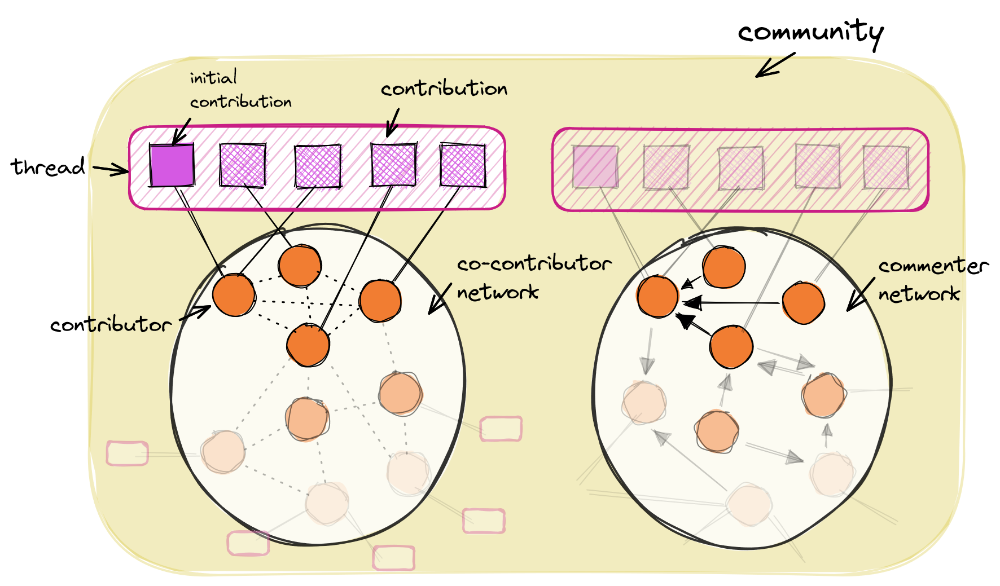

# Indicators

The toolbox provides a repository of [predefined indicators](../../indicators) and simple tools to add new, custom indicators.

## Overview
 
### Structure
 
By default, the central unit of observation is the forum **thread**, which can be part of one or multiple sub-forums. We propose that a thread is the *observable trace* of a sequence of interactions that can represent or display innovation activities. Each post in a thread is a **contribution** by a community member (the **contributor**). We single out the **initial contribution**, as we assume that XYZ. A **community** consists of a number of contributors and their contributions in threads, which are organized in sub-forums.
 
### Networks
 
Additional levels of observation are the **networks** formed by contributors. The two main representations are the *co-contribution network* and the *comment network*.
 
`co-contributor network`
 
: The co-contributor network is an *undirected graph* where each node represents a contributor. A pair of contributors is connected by an edge if both have contributed in at least one shared thread. The edge weight is proportional to the number of threads both contributed to.
 
`commenter network`
 
: The commenter network is a *directed graph* where each node represents a contributor. A contributor *A* has an edge pointing to contributor *B* if *A* has contributed in at least one thread where contributor *B* has posted the initial contribution (*A* has "commented"). The weight of edge *A*→*B* is proportional to the total number of comments *A* made on initial contributions of *B*.
 
<p align="center">
    
</p>
 
### Levels of observation
 
Each indicator is observed on either **contributor**, **contribution**, **thread**, or **community** level. Aggregations of indicators are provided for higher levels. For example, the *number of contributions made by a contributor* can be an indicator for their role in the community. This indicator would be provided on thread-level as, e.g., *average number of contributions per contributor*, measured for all contributors that have contributed to a specific thread. Common aggregations are mean, sum, concate, standard-deviation, min and max. Other aggregations (or *transformations*) could also pick out a single of multiple values. On thread-level, an example would be the *total number of contributions made by the contributor of the initial contribution*.
 
The thread observation level can be subdivided into three further subsets of posts: the whole thread, only the **initial contribution**, or only the **feedback** (all posts that were not authored by the initial contributor). This helps to implement indicators that rely on more detailed concepts, such as *ideas* in *idea communities*, or *questions* in *question communities*, which can potentially be operationalized by *inital contribution*.
 
[TODO: Grafik]
 
### Data
 
In order to be able to apply indicators to a heterogeneous set of communities, most indicators rely on the following basic data that can be collected from most online forums:
 
- contribution meta data: contributor, date, associated thread, position in thread, sub-forum
- contribution content: text, html, extracted links, images
- contributor properties: name/id
- thread: title
 
Other data, such as likes/upvotes, friendship-relations, contributor location, thread views, etc., might be available in some communities and can be included in more specialized indicators.

## Generating indicator values

Reports are groups of metrics. You can use reports if you would like to analyze a certain subset of metrics in one table, or if you would like to compare results for different metric parameters.

There are several [pre-defined reports][pici.metrics.reports] that can be generated by calling ``pici.reports.example_report()``:

=== "Python"
    ``` py
    pici.reports.summary()
    ```

=== "Output"
    ```
     TODO
    ```

A custom report can be defined by calling [Pici.add_report][pici.Pici] with a list of metrics that should be included in the report. Each metric is listed as a tuple of metric function and metric arguments (as dict).

A report that shows the number of posts in total, per week, and per quarter could be defined like this: 

``` py
from pici.metrics.basic import number_of_posts, agg_number_of_posts_per_interval

p.add_report(
    name='posts',
    list_of_metrics=[
        (number_of_posts, {}),
        (agg_number_of_posts_per_interval, {'interval': '1W'}),
        (agg_number_of_posts_per_interval, {'interval': '3M'})
    ]
)

# generate report:
p.reports.posts()
```
 
## Defining new indicators

You can define custom metrics that can then be used just like the pre-defined metrics. A custom metric is implemented as a decorated function and needs to be added to the "metrics registry".

### the @metric decorator

You can define a custom metric by implementing a method that has the ``@metric`` decorator from [pici.decorators][pici.decorators] and takes (at least) ``community`` as parameter: 

``` py
from pici.decorators import metric

@metric(...)
def my_metric(community):
    # calculate something
```

The decorator takes two arguments, ``level`` and ``returntype``. The level determines about which *level of observation* the metric gives information, for example the whole community, and ``returntype`` says whether your metric returns values that can be displayed on a single row in a table (TABLE), whether it returns values on multiple rows (DATAFRAME, for example one result for each thread in the community), or whether it returns a single value (PLAIN, can also be something else than a number).

A decorator for a metric that measures a single value for a community, for example the *total number of contributors*, would be defined like this:

``` py
from pici.decorators import metric
from pici.datatypes import CommunityDataLevel, MetricReturnType

@metric(
    level=CommunityDataLevel.COMMUNITY,
    returntype=MetricReturnType.TABLE
)
def total_number_of_contributors(community):
    # calculate something
```

A metric that measures multiple values per community, for example the *number of posts in each topic*, would use the decorator like this:

``` py
...
@metric(
    level=CommunityDataLevel.TOPICS,
    returntype=MetricReturnType.DATAFRAME
)
def number_of_posts_per_topic(community):
    # calculate something
```

??? more
    - The ``level`` can be any value specified in [CommunityDataLevel][pici.datatypes] (COMMUNITY, TOPICS, POSTS, ...):
        - ``CommunityDataLevel.COMMUNITY``: One value for the community
        - ``CommunityDataLevel.POSTS``: One value for each post in the community
        - ``CommunityDataLevel.TOPICS``: One value for each topic (thread) in the community
        - ...
    - The ``returntype`` can be any value of [MetricReturnType][pici.datatypes]:
        - ``MetricReturnType.PLAIN``
        - ``MetricReturnType.TABLE``
        _ ``MetricReturnType.DATAFRAME``

### return values

A metric can return one or multiple values (in a dictionary). If your ``returntype`` is ``TABLE`` or ``DATAFRAME``, the metric's return values must be named entries in a dictionary. The columns in the resulting dataframe will then correspond to these names.

=== "Python"
    ``` py
    from pici.decorators import metric
    from pici.datatypes import CommunityDataLevel, MetricReturnType
    
    @metric(
        level=CommunityDataLevel.COMMUNITY,
        returntype=MetricReturnType.TABLE
    )
    def total_number_of_contributors(community):
        # calculate something
        
        return {
            'number of contributors': # calculated value
        }
    ```

=== "Example output"
    ```
    --------------------------------------
    | community | number of contributors |
    --------------------------------------
    |     A     |          1745          |
    |     B     |           385          |
    |     C     |           947          |
    |    ...    |           ...          |
    |-----------|------------------------|
    ```

A use case for returning multiple values as dictionary entries are, for example, different aggregations:

=== "Python"
    ``` py
    from pici.decorators import metric
    from pici.datatypes import CommunityDataLevel, MetricReturnType
    
    @metric(
        level=CommunityDataLevel.COMMUNITY,
        returntype=MetricReturnType.TABLE
    )
    def posts_per_week(community):
        # calculate something
        
        return {
            'mean posts per week': # val 1
            'max posts per week': # val 2
            'min posts per week': # val 3 
        }
    ```

=== "Example output"
    ```
    -----------------------------------------------------------------------------
    | community | mean posts per week | max posts per week | min posts per week |
    -----------------------------------------------------------------------------
    |     A     |          37.5       |         144        |         16         |
    |     B     |          18.2       |          39        |          5         |
    |     C     |          27.6       |          47        |          0         |
    |    ...    |          ...        |         ...        |        ...         |
    |-----------|---------------------------------------------------------------|
    ```

### registering a new metric

Custom metrics need to be added to the "metrics registry", so that they can be used like pre-defined metrics through ``Community.metrics.my_metric()`` or in [reports][pici.metrics.Reports]. This can be done either via [``Pici.add_metric()``][pici.Pici] (adds metric for all communities), or via [``Community.metrics.add()``][pici.metrics.Metrics] for a single community:

``` py

from pici import Pici
from pici.communities import OEMCommunityFactory, PPCommunityFactory


p = Pici(communities={
    'OpenEnergyMonitor': OEMCommunityFactory,
    'PreciousPlastic': PPCommunityFactory,
})

@metric()
def my_metric(communities):
    # ...

# add metric to a community:
p.communities['OpenEnergyMonitor'].metrics.add(my_metric)

# call metric
p.communities['OpenEnergyMonitor'].metrics.my_metric()

# add metric to all communities:
p.add_metric(my_metric)

# call metric
p.communities['PreciousPlastic'].metrics.my_metric()
```

## Evaluating indicators using labelled data